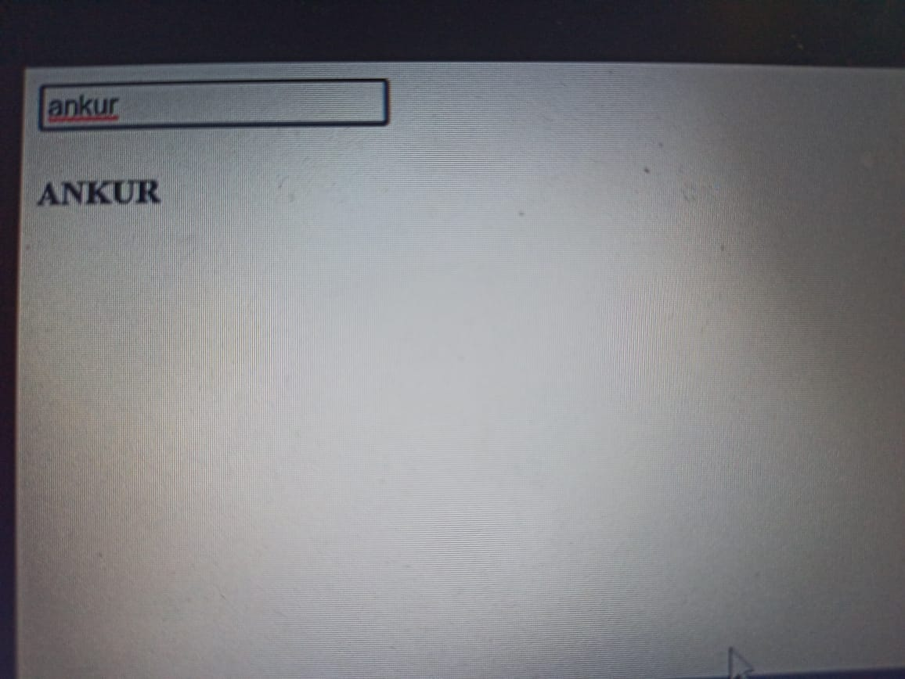

### program coverts strings to uppercase in real time no need of button--MAIN CODE=
### HTML
<code>
<div id="app">
  <input type="text" v-model="message" />
  <h4>{{ message | uppercase }}</h4>
</div>
</code>

### JAVASCRIPT

Vue.filter('uppercase', function (value) {
	return value.toUpperCase()
})

new Vue({
	el: '#app',
  data: {message: ''
  }
})


### output image


## Project setup
```
npm install
```

### Compiles and hot-reloads for development
```
npm run serve
```

### Compiles and minifies for production
```
npm run build
```

### Lints and fixes files
```
npm run lint
```

### Customize configuration
See [Configuration Reference](https://cli.vuejs.org/config/).

